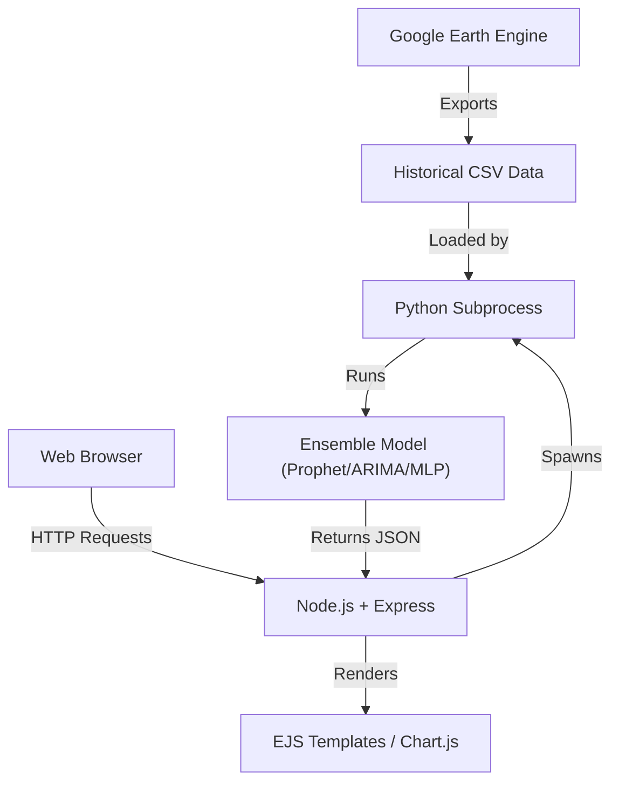

# 🌊 Water Quality Forecast & Analytics System

> **Intelligent Forecasting for Tamil Nadu Districts using Ensemble Learning (Prophet + ARIMA + Neural Network)**


## 📋 Overview

This project is a comprehensive **Water Quality Monitoring and Forecasting System** designed to predict **Chlorophyll-a** levels and assess environmental risks across districts in Tamil Nadu. It leverages **Google Earth Engine** for satellite data acquisition and combines it with a robust **Node.js/Express web dashboard**.

The core innovation is the **Ensemble Model**, which averages predictions from **Prophet**, **ARIMA**, and a **Neural Network (LSTM Proxy)** to deliver highly accurate forecasts with uncertainty quantification.

## ✨ Key Features

*   **🌍 Satellite-Driven Data:** Utilizes **Google Earth Engine (GEE)** to harvest real-time environmental data (MODIS Chlorophyll, CHIRPS Precipitation).
*   **🔮 Hybrid Ensemble Forecasting:** Combines statistical (ARIMA), regression (Prophet), and deep learning proxy (MLP Neural Network) models for superior accuracy.
*   **🎛️ "What-If" Simulation Engine:** Evaluate the impact of climate change by adjusting **Precipitation** and **Temperature** sliders to see how they affect future water quality.
*   **📊 Interactive Analytics Dashboard:**
    *   **Leaderboard:** Rank districts by contamination levels.
    *   **Risk Profiling:** Automatic categorization (Safe / Warning / Critical).
    *   **Anomaly Detection:** Highlights historical extreme events (Heatwaves, Flash Floods).
*   **📱 Modern UI/UX:** Responsive Glassmorphism design built with EJS and CSS.

## 🗺️ Development Roadmap

### Phase 1: Foundation & Infrastructure (60%)
*   **Goal:** Establish data pipelines and web architecture.
*   ✅ **Google Earth Engine Integration:** Automated extraction of Chlorophyll, Temp, and Rainfall.
*   ✅ **Data Pipeline:** Pre-processing and cleaning of satellite datasets.
*   ✅ **Web Dashboard:** Responsive UI with Node.js/Express backend.

### Phase 2: Intelligence & Simulation (40%)
*   **Goal:** Implement AI predictions and decision support.
*   ✅ **Ensemble Forecasting:** Integration of Prophet + ARIMA + Neural Network.
*   ✅ **"What-If" Simulation:** Real-time impact analysis of weather changes.
*   ✅ **Advanced Analytics:** Anomaly detection and District Leaderboards.

## 🏗️ Architecture



## 🚀 Getting Started

### Prerequisites

*   **Node.js** (v16 or higher)
*   **Python** (v3.8 or higher)
*   **pip** (Python package manager)

### Installation

1.  **Clone the Repository**
    ```bash
    git clone https://github.com/your-username/water-quality-forecast.git
    cd water-quality-forecast
    ```

2.  **Setup the Backend (Node.js)**
    ```bash
    npm install
    ```

3.  **Setup the Data Science Engine (Python)**
    *   Create a virtual environment (recommended):
        ```bash
        python3 -m venv venv
        source venv/bin/activate  # On Windows: venv\Scripts\activate
        ```
    *   Install dependencies:
        ```bash
        pip install -r requirements.txt
        ```
    *   *Note:* Ensure you have `prophet`, `pandas`, `statsmodels`, and `scikit-learn` installed.

### Running the Application

1.  **Start the Server:**
    ```bash
    node app.js
    ```
    *   *Tip:* The server will automatically use the Python environment in `./venv`.

2.  **Access the Dashboard:**
    Open your browser and navigate to:
    `http://localhost:3000`

## 📂 Project Structure

*   `app.js` - Main Entry point (Express Server).
*   `ensemble_model.py` - Core Forecasting Logic (Prophet + ARIMA + LSTM) + Simulation.
*   `get_analytics.py` - Script for computing Dashboard stats (Leaderboards, Risks).
*   `dataset/` - Contains the CSV data sources.
*   `views/` - Frontend Templates (EJS).
*   `assets/` - CSS, Images, and client-side JS.
*   `docs/` - (Optional) Additional documentation.

## 🧪 Simulation & Methodology

The application allows you to simulate hypothetical scenarios to test resilience:
1.  **Select a District.**
2.  **Set Forecasting Window.**
3.  **Adjust Sliders:**
    *   *Precipitation Factor:* e.g., Set to `1.2x` to simulate 20% more rain.
    *   *Temperature Bias:* e.g., Set to `+2.0°C` to simulate global warming.
4.  **Run Forecast:** The system calculates the correlation-weighted impact of these weather changes on the Chlorophyll baseline.

### ⚡ Performance Optimization & Caching
To ensure instant response times during user interactions:
*   **Neural Network Proxy:** The deep learning model uses a fast Multi-Layer Perceptron (MLP) as a proxy, completely avoiding TensorFlow's heavy CPU/RAM startup overhead.
*   **Forecast Caching:** Baseline forecasts (before weather modifications) are calculated once and stored in `dataset/forecast_cache.json`. Slider adjustments run instantly (under 0.05 seconds) using cached data.
*   **Cache Precomputation:** You can pre-generate baseline forecasts for all 37 districts by running:
    ```bash
    python precompute_cache.py
    ```

## 👥 Authors

*   **Abdul Rahman M** - *Lead Developer, Research & Implementation*

## 📄 License

This project is licensed under the MIT License - see the LICENSE file for details.
